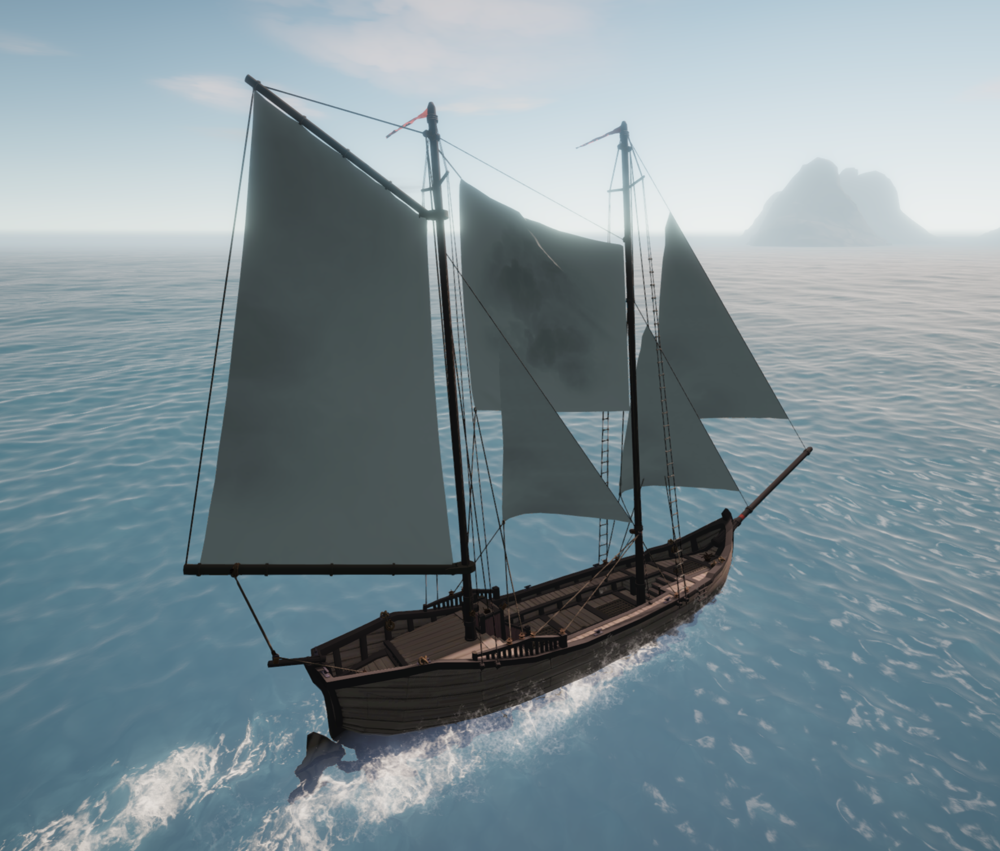
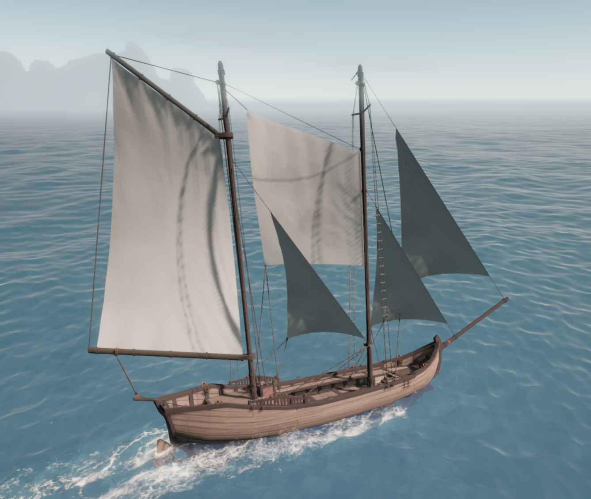
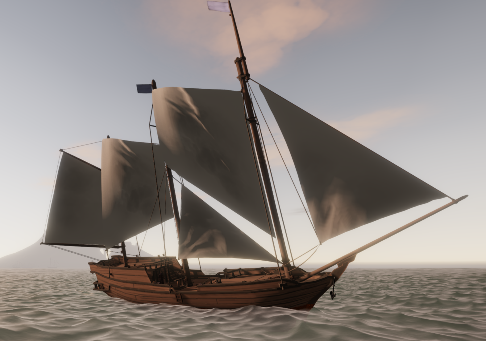

# MoreSailwindSails

MoreSailwindSails adds new sail types to Sailwind, with room for more as they
are developed. The mod currently includes two sail families:

- **Fisherman's Staysails** — Mk.A, Mk.B and Mk.C cuts fitted to a Fisherman's Stay
  between two masts.
- **Fisherman's Flying Sails** — sails fitted directly to a physical mast,
  with an active mast behind it for support.

**Fisherman's Stays** provide the rigging mounts for the staysail family.

Version **0.2.0**.

  
  
  

Select a screenshot to view it at full size.

## New in 0.2.0

- **Staysail Mk.C**, with a longer luff and a foot rising toward the aft mast.
- A smaller **Flying Sail** with a trapezoid cut, fixed mast ties, rounded billow,
  revised control ropes and corner knots.
- Corrected sheet-winch placement along measured rails and other solid supports.
- Support for Sailwind 0.39's **large Al’Ankh dhow** and a fix for custom sail
  sound initialization.

## What's included

| Sail or rigging               | What it adds                                                                                                                                |
| ----------------------------- | ------------------------------------------------------------------------------------------------------------------------------------------- |
| **Fisherman's Stay**          | A high stay between two masts, with variants for supported mast and topmast combinations.                                                   |
| **Fisherman's Staysail Mk.A** | A four-corner sail with a sloping head and a lower edge that slopes downward toward the aft mast.                                           |
| **Fisherman's Staysail Mk.B** | The same head and controls as Mk.A, with a straight lower edge perpendicular to the mast—level with the deck on upright masts.              |
| **Fisherman's Staysail Mk.C** | The same head and controls, with a 50% longer luff and a lower edge rising 40° from the forward luff toward the aft leech on upright masts. |
| **Fisherman's Flying Sail**   | A separate sail fitted directly to a mast through the **Other** category.                                                                   |

Supported boats: **Brig, Junk, Jong, Sanbuq, Cog, Leopard, Shroud and the large
Al’Ankh dhow introduced in Sailwind 0.39**.
Leopard and Shroud require their corresponding boat mods. Available stay
variants depend on the boat and its fitted masts. The new large dhow profile
awaits in-game validation; its larger mast winches have limited room for
additional controls when multiple custom sails share a mast.

## Requirements and installation

- Built against **Sailwind 0.39**
- **BepInEx 5**
- **Shipyard Expansion** (developed against version 0.11.1)

1. Close Sailwind.
2. Place `MoreSailwindSails.dll` in
   `<Sailwind>/BepInEx/plugins/MoreSailwindSails/`, creating the folder if needed.
3. When updating, replace the old DLL and remove any duplicate copies.
4. Launch the game and visit a shipyard.

## Fitting a staysail

1. Open the shipyard's **rigging parts** and select **Fisherman's Stay** for
   the mast pair you want to use.
2. Choose the variant matching your fitted masts and topmasts.
3. Select that stay in the sail-fitting controls, open **Staysails**, and
   choose **Fisherman's Staysail Mk.A**, **Mk.B** or **Mk.C**.
4. Resize and position the sail with the normal shipyard controls, leaving
   clearance from the deck, aft mast and other rigging.
5. Complete the shipyard order.

**Mk.A, Mk.B and Mk.C fit only on Fisherman's Stays.** Each stay carries one sail;
these stays can also carry vanilla staysails. Supported three-masted boats
offer additional mast pairs.

All three cuts start with the same width; Mk.C has a luff 50% longer than Mk.A
and Mk.B and needs more room on the forward mast. They can be resized uniformly.
New sails are white and plain, with normal recoloring available. Heads follow
the fitted stay; foot cuts use the forward mast’s frame and tilt with mast rake.

Remove a fitted sail before replacing or removing its stay. If you change a
supporting mast or add a topmast, choose a matching stay variant as part of the
shipyard changes.

## Using the Flying Sail

At a shipyard, select a **physical mast**, open **Other**, and choose
**Fisherman's Flying Sail**. It needs a supported active mast behind it.

Its own hoist winch raises it from the deck, and its port and starboard sheets
control the trim. Fully lowering it hides the sail.

Two fixed 18-inch ties hold the luff corners away from the mast while the luff
arches inward. The trapezoid cut has a rising head and falling foot; leave room
for the higher aft head below its supporting pulley. For geometry and rigging
details, see the [Flying Sail reference](docs/DEVELOPMENT.md#flying-sail).

## Removing the mod

Before uninstalling, remove all sails and rigging added by MoreSailwindSails
(currently the Fisherman's sails and stays), then save your game. Remove fitted
sails before removing the stays or masts that support them.

For building the mod, technical details and testing notes, see the
[development guide](docs/DEVELOPMENT.md).
