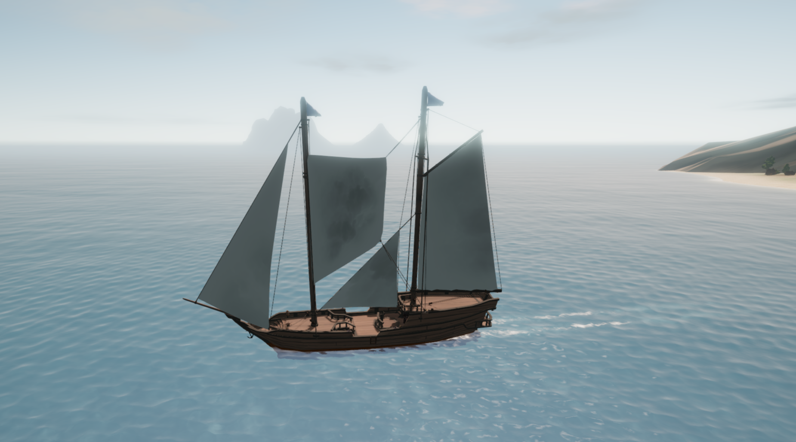

# Fisherman's Sail

A Sailwind mod that adds a four-corner **Fisherman's Sail** between two masts.
Version **0.1.0**.

- Supported boats: Brig, Junk, Jong, Sanbuq, Cog, Leopard and Shroud.
- Independent port and starboard sheets, plus a hoist winch.
- Outward travel limited to 40° on each side, with tighter limits where obstructed.
- White and plain by default, with normal recoloring and no texture selector.
- Deck-up hoisting, partial furling and invisible cloth when fully lowered.

## Requirements

- Sailwind with **BepInEx 5** installed.
- **Shipyard Expansion** (developed against version 0.11.1).
- The corresponding boat mod to use the sail on Leopard or Shroud.

## Installation

1. Close Sailwind.
2. Place `FishermansSail.dll` in
   `<Sailwind>/BepInEx/plugins/FishermansSail/`, creating the folder if needed.
   When updating, replace the existing DLL and remove any duplicate copies.
3. Launch the game. Check `<Sailwind>/BepInEx/LogOutput.log` for
   `Fisherman's Sail 0.1.0 loaded!`.

Only the plugin DLL is needed. To build it yourself, see the
[development guide](docs/DEVELOPMENT.md).

## Fitting and sailing

At a shipyard, select a physical mast, open **Other**, and choose
**Fisherman's Sail**. The selected mast needs a supported active mast behind it,
with halyard fittings on both masts. The aft mast does not need to carry a sail.
On the Brig, select the foremast and use the mainmast as aft support. Supported
three-masted boats can also use a mainmast with a mizzenmast behind it.

Use the normal shipyard controls to resize and position the sail. Its forward
edge must fit the selected mast, both upper corners must sit below their pulleys,
and the aft edge must clear the supporting mast and rigging. The default sail is
13.8 m wide, so resizing is often necessary. Normal mast capacity, vertical-space
and collision rules apply.

Use the sail's own hoist and port/starboard sheet winches. The cloth opens as it
rises from the forward mast's deck base. Fully lowering it hides the cloth and
parks its rope ends at the mast pulleys. Other sails retain their own controls.

New sails use the game's existing white color and plain texture. Recoloring
remains available, and saved colors are retained. Painted texture choices are
disabled for this sail; saved patterns become plain when loaded.

## Saving and uninstalling

The sail uses native mast save slots and keeps prefab index **400**, including
when loading saves from development builds. Remove its sails and save before
uninstalling the mod. Remove a Fisherman's Sail before removing either mast
that supports it.

## Development and testing

The plugin targets `netstandard2.0`. The repository provides a Nix development
environment with .NET 8, CSharpier and automated geometry and assembly checks.
See the [development guide](docs/DEVELOPMENT.md) for build commands, local
installation, verification and implementation notes.

Automated checks do not simulate Unity rendering, Cloth or hinge physics.
A fresh in-game check of the 0.1.0 build, including appearance and menu behavior,
remains pending.
